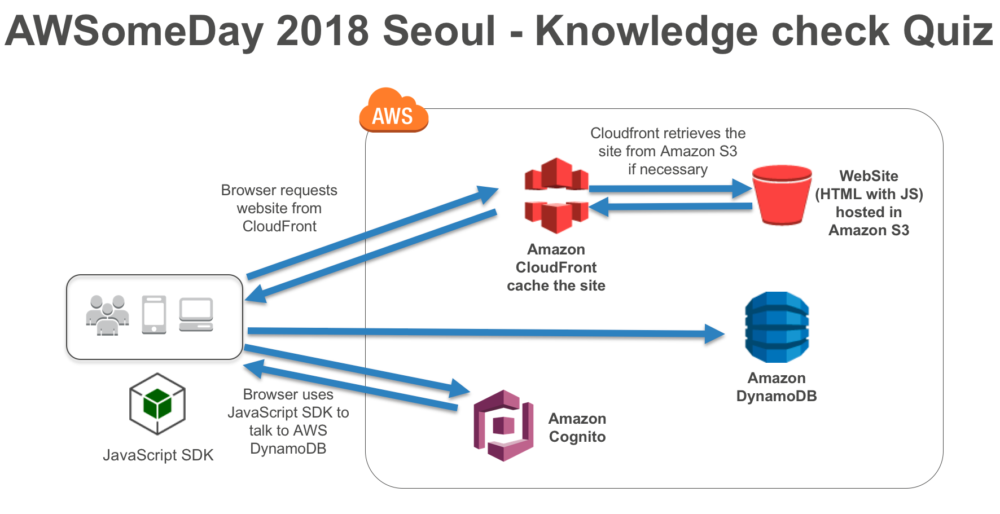
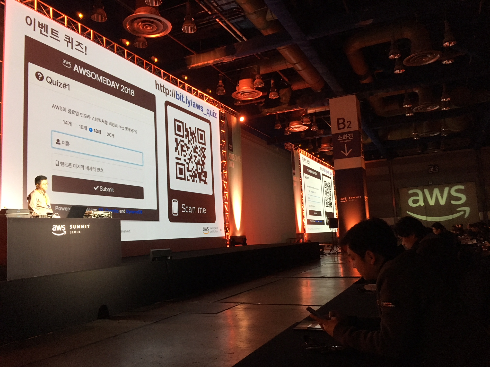

# awsomeday2018-quiz
This is a repository of the quiz app used for the AWSomeDay-Seoul event on April 18, 2018. It is a real-time quiz event application. This application used at the AWSomeDay event on April 18, 2018.  The quiz event went on the end of each session. The participants could scan QRCode or type short-URL for the event. They could connect to event webpage and submit the answer. After a while draw the right answer.

# Architecture


# Setup
Conduct following steps

## Step 1
Create DynamoDB Table

```
aws dynamodb create-table \
    --table-name quiz \
    --attribute-definitions \
        AttributeName=eventName,AttributeType=S AttributeName=date,AttributeType=S \
    --key-schema AttributeName=eventName,KeyType=HASH AttributeName=date,KeyType=RANGE \
    --provisioned-throughput ReadCapacityUnits=5,WriteCapacityUnits=5 --region <YOUR_REGION>

{
    "TableDescription": {
        "AttributeDefinitions": [
            {
                "AttributeName": "date",
                "AttributeType": "S"
            },
            {
                "AttributeName": "eventName",
                "AttributeType": "S"
            }
        ],
        "TableName": "quiz",
        "KeySchema": [
            {
                "AttributeName": "eventName",
                "KeyType": "HASH"
            },
            {
                "AttributeName": "date",
                "KeyType": "RANGE"
            }
        ],
        "TableStatus": "CREATING",
        "CreationDateTime": 1524530707.419,
        "ProvisionedThroughput": {
            "NumberOfDecreasesToday": 0,
            "ReadCapacityUnits": 5,
            "WriteCapacityUnits": 5
        },
        "TableSizeBytes": 0,
        "ItemCount": 0,
        "TableArn": "arn:aws:dynamodb:ap-northeast-2:XXXX33669077:table/quiz",
        "TableId": "d9bc3875-ced3-452c-b6ed-4fa8a9571285"
    }
}

```

Keep the TableArn value. (ex: arn:aws:dynamodb:ap-northeast-2:XXXX33669077:table/quiz)


## Step 2 
Create Cognito Identity pool.
```
aws cognito-identity create-identity-pool \                                                                                                                                         
    --allow-unauthenticated-identities \
    --output json --region <YOUR_REGION>
{
    "IdentityPoolId": "ap-northeast-2:xxxx9289-0ca4-4306-b64c-a2db4b528de8",
    "IdentityPoolName": "quiz_pool",
    "AllowUnauthenticatedIdentities": true
}

```
Keep the IdentityPoolId value. (ex: ap-northeast-2:xxxx9289-0ca4-4306-b64c-a2db4b528de8)


## Step 3
Update <YOUR_COGNITO_IDENTITY_POOL_ID> to your actual cognito identity pool ID in `myCognitoPolicy.json`.

```json
{
  "Version": "2012-10-17",
  "Statement": [
    {
      "Effect": "Allow",
      "Principal": {
        "Federated": "cognito-identity.amazonaws.com"
      },
      "Action": "sts:AssumeRoleWithWebIdentity",
      "Condition": {
        "StringEquals": {
          "cognito-identity.amazonaws.com:aud": "<YOUR_COGNITO_IDENTITY_POOL_ID>"
        },
        "ForAnyValue:StringLike": {
          "cognito-identity.amazonaws.com:amr": "unauthenticated"
        }
      }
    }
  ]
}

```


## Step 4
Create IAM role for unauthenticated user.

```
aws iam create-role --role-name Cognito_DynamoPoolUnauth \
--assume-role-policy-document file://myCognitoPolicy.json --output json --region <YOUR_REGION>

{
    "Role": {
        "Path": "/",
        "RoleName": "Cognito_DynamoPoolUnauth",
        "RoleId": "AROAJMWTA5KM6O5JMIPHQ",
        "Arn": "arn:aws:iam::xxxx33669077:role/Cognito_DynamoPoolUnauth",
        "CreateDate": "2018-04-24T04:38:21.395Z",
        "AssumeRolePolicyDocument": {
            "Version": "2012-10-17",
            "Statement": [
                {
                    "Effect": "Allow",
                    "Principal": {
                        "Federated": "cognito-identity.amazonaws.com"
                    },
                    "Action": "sts:AssumeRoleWithWebIdentity",
                    "Condition": {
                        "StringEquals": {
                            "cognito-identity.amazonaws.com:aud": "ap-northeast-2:xxxx98ec-2f2f-4623-b5f8-70a129544482"
                        },
                        "ForAnyValue:StringLike": {
                            "cognito-identity.amazonaws.com:amr": "unauthenticated"
                        }
                    }
                }
            ]
        }
    }
}
```

## Step 5
Attach the policy to the IAM role `Cognito_DynamoPoolUnauth`.
```
aws iam attach-role-policy --policy-arn arn:aws:iam::aws:policy/AmazonDynamoDBFullAccess \
--role-name Cognito_DynamoPoolUnauth --region <YOUR_REGION>
```

## Step 6
Get the role-arn using following command.
```
aws iam get-role --role-name Cognito_DynamoPoolUnauth --output json                                                        
{
    "Role": {
        "Path": "/",
        "RoleName": "Cognito_DynamoPoolUnauth",
        "RoleId": "AROAJMWTA5KM6O5JMIPHQ",
        "Arn": "arn:aws:iam::xxxx33669077:role/Cognito_DynamoPoolUnauth",
        "CreateDate": "2018-04-24T04:38:21Z",
        "AssumeRolePolicyDocument": {
            "Version": "2012-10-17",
            "Statement": [
                {
                    "Effect": "Allow",
                    "Principal": {
                        "Federated": "cognito-identity.amazonaws.com"
                    },
                    "Action": "sts:AssumeRoleWithWebIdentity",
                    "Condition": {
                        "StringEquals": {
                            "cognito-identity.amazonaws.com:aud": "ap-northeast-2:xxxx98ec-2f2f-4623-b5f8-70a129544482"
                        },
                        "ForAnyValue:StringLike": {
                            "cognito-identity.amazonaws.com:amr": "unauthenticated"
                        }
                    }
                }
            ]
        },
        "MaxSessionDuration": 3600
    }
}
```

## Step 7
Excute folloing command with your own `identity-pool-id` and `unauthenticated role arn`.
```
aws cognito-identity set-identity-pool-roles \
--identity-pool-id "<YOUR_COGNITO_IDENTITY_POOL_ID>" \
--roles unauthenticated=<YOUR_ROLE_ARN> --output json
```

## Step 8
Now you can modify the code of `index.html` and `draw.html` files.

* YUOR-REGION-CODE
* YOUR-COGNITO-IDENTITY-POOL-ID

```JavaScript

      //TODO #1: Update <YUOR-REGION-CODE> to your actual region code. (ex:ap-northeast-2)  
      AWS.config.region = "<YUOR-REGION-CODE>";
      AWS.config.credentials = new AWS.CognitoIdentityCredentials({
        //TODO #2: Update <YOUR-COGNITO-IDENTITY-POOL-ID> to your actual pool id.
        IdentityPoolId: "<YOUR-COGNITO-IDENTITY-POOL-ID>"
      });
```

Modify the code of in the `index.html` and `draw.html` files.
* DDB-TABLE-NAME
```
        var params = {
            //TODO #3: Update <DDB-TABLE-NAME> to your actual DDB-TABLE-NAME.
            TableName :"<DDB-TABLE-NAME>",
            Item:{
                "eventName": "awsomeday2018",
                "date": currDate,
                "name": $('#name').val(),
                "phoneNum": $('#phoneNum').val(),
                "answer": solutionChecked,
                "userAgent": navigator.userAgent
            }
        };
```

# Step 9
Now, you can test this app several ways if your AWS resources are ready!
* Local file access via your web browser.
* Or, using local webser such `python -m http.server 8000`.
* Or, deploy it to the static web hosting enabled S3 bucket.

Enjoy it!

Thanks.



